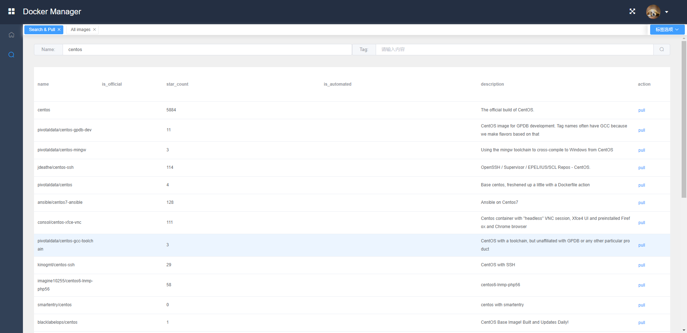

# docker-manager
Construst docker manager to manage docker

## Introduction

This system is built to manage the Docker system and is a Docker scheduling system. Provides an interface to manage a series of things related to Docker images, containers, and networks. Provides a web interface to manage containers that are already running.
This system can be used by companies to schedule docker resources, manage small applications that the company runs on docker, and can also be used to quickly build AWD offense and defense games.

## Structure

## How to use it?

## UI

## License

This system uses the Apache License 2.0 License. Hope that interested friends can contribute their own code to make this system more perfect.
